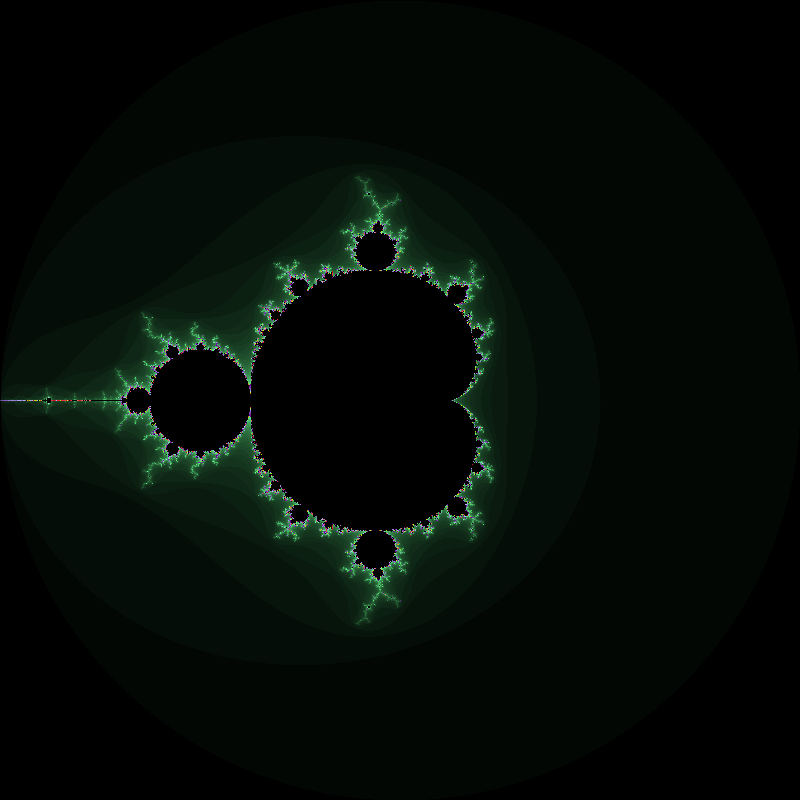

# Fractals of Mandelbrot simulation.
_This is a Mandelbrot fractal simulator written in C++ for Linux. It generates fractals by iterating the suite_ $z_{n+1} = z_n^p + c$ _for each pixel in the window, where_ $z$ _and_ $c$ _are complex numbers, and_ $n$ _the index of the sequence. If the absolute value of_ $z$ _exceeds a certain threshold, the pixel is colored based on how many iterations were required to exceed the threshold._

Requirements:

- C++ compiler (tested with g++ 11.3.0)
- [SFML](https://www.sfml-dev.org/index-fr.php) library
- GNU Make (optional)

---

### Usage

To build the simulator, run ```make``` in the project directory. This will generate an executable file called ```fractal```. To run the simulator, execute ```./fractal``` with the following optional command-line arguments:

- ```<dimension>```: The dimension of the window
- ```<power>``` : The power of the Mandelbrot fractal
- ```<iterations>``` : Maximum number of iterations per pixel

For example, To generate a mandelbrot fractal to the power of 2 with a maximum iteration of 80, here is the command to write :

```./fractal 600 2 100```

The result should be:



For clean all compilation traces, you can run ```make clean```.

---

### License

This project is licensed under the GPL License. See the LICENSE file for details.

---

### Acknowledgements

This project was inspired by the Mandelbrot set and the many great examples available online.
